[](https://hacs.xyz/)
[](LICENSE)
[](https://github.com/Xerolux/heatpump-flow-card/releases/latest)
[](https://xerolux.github.io/heatpump-flow-card/)

Ein animiertes Hydraulikschema für Home Assistant. Die Karte zeichnet deine
Heizungsanlage so, wie sie verrohrt ist – Wärmepumpe, Pufferspeicher,
Warmwasser, Photovoltaik, Solarthermie und bis zu sieben Heizkreise – und stellt
die Live-Werte genau dort dar, wo sie hingehören.

*[English version](README.md)* · **[Live-Demo](https://xerolux.github.io/heatpump-flow-card/)** · **[Wiki](https://github.com/Xerolux/heatpump-flow-card/wiki)**

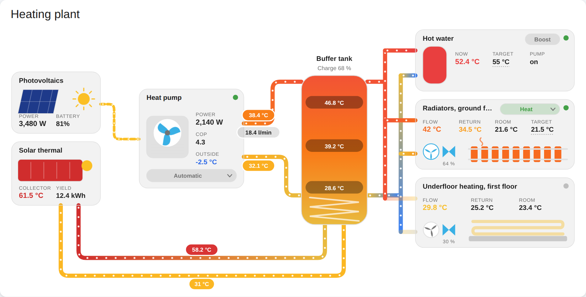

## Was die Karte kann

* **Rohre transportieren Temperaturen.** Jedes Rohr wird nach der Temperatur
  eingefärbt, die es führt. Sind beide Enden bekannt, verläuft die Farbe
  *entlang des Rohres* – man sieht also, wie das Wasser auf dem Rückweg von den
  Heizkörpern abkühlt.
* **Was läuft, bewegt sich.** Der Ventilator der Wärmepumpe dreht sich (schneller
  bei höherer Verdichterlast), Umwälzpumpen laufen, und durch jedes
  durchströmte Rohr wandern Punkte. Inaktive Stränge werden abgedunkelt und
  stehen still.
* **Alles ist bedienbar.** Klick auf die Wärmepumpe schaltet sie ein oder aus,
  Klick auf einen Betriebsart-Chip wählt Heizen, Kühlen oder Warmwasser, Klick
  auf einen Sollwert öffnet ein Plus/Minus-Stellfeld. Langes Drücken öffnet
  immer den Info-Dialog.
* **Jeder Heizkreis antwortet für sich.** Dass Kreis A läuft, sagt nichts über
  Kreis D: jedes Panel, jede Pumpe und jedes Rohr zeigt den eigenen Zustand.
* **Achtzehn fertige Layouts** – von der kompakten Karte mit einem Kreis bis zur
  kompletten Anlage, mit oder ohne Warmwasser, PV, Solarthermie oder Puffer.
* **Grafischer Editor** – YAML ist möglich, aber nicht nötig.
* **Nichts ist Pflicht.** Fehlt ein Sensor, bleibt die Stelle einfach leer,
  statt dass die Karte kaputtgeht.
* Deutsche und englische Beschriftung, helles und dunkles Theme, und
  `prefers-reduced-motion` wird respektiert.

## Layouts

Im Editor eine fertige Anlage auswählen oder `layout:` im YAML setzen. Das
Layout legt nur fest, was **standardmäßig** gezeichnet wird – jeder Abschnitt
lässt sich mit einem eigenen Block ergänzen oder mit `false` entfernen.

| `layout` | Speicher | Warmwasser | PV | Solarthermie | Heizkreise |
| --- | :-: | :-: | :-: | :-: | :-: |
| `compact` | ● | | | | 1 |
| `compact-dual` | ● | | | | 2 |
| `single` | ● | | | | 1 |
| `dual` | ● | | | | 2 |
| `triple` | ● | | | | 3 |
| `quad` | ● | | | | 4 |
| `dhw` | ● | ● | | | 1 |
| `dhw-dual` | ● | ● | | | 2 |
| `dhw-quad` | ● | ● | | | 4 |
| `pv-single` | ● | | ● | | 1 |
| `pv-dual` | ● | | ● | | 2 |
| `pv-dhw-dual` | ● | ● | ● | | 2 |
| `solar-dual` | ● | ● | | ● | 2 |
| `full` | ● | ● | ● | ● | 2 |
| `full-quad` | ● | ● | ● | ● | 4 |
| `direct` | | | | | 1 |
| `direct-dual` | | | | | 2 |
| `direct-dhw` | | ● | | | 2 |

Bis zu **sieben** Heizkreise (A–G) sind möglich – `circuits:` sticht immer das,
was das Layout mitbringt.

## Galerie

**`compact` – Wärmepumpe, Speicher, ein Kreis, passt in eine schmale Spalte**

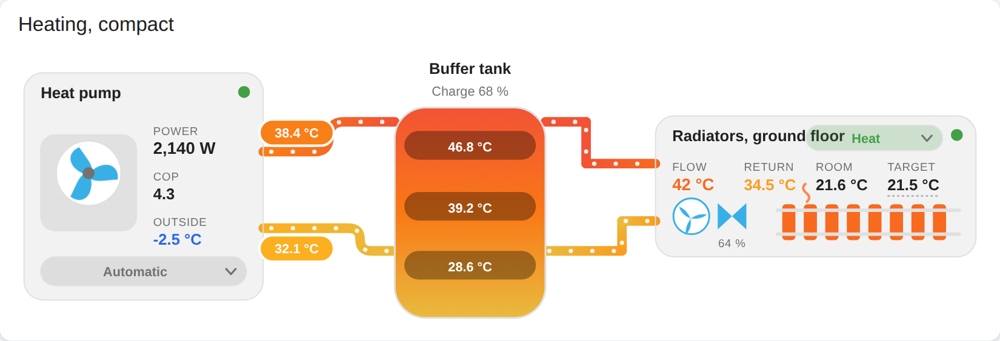

**`single` – ein Heizkreis mit allen Details**

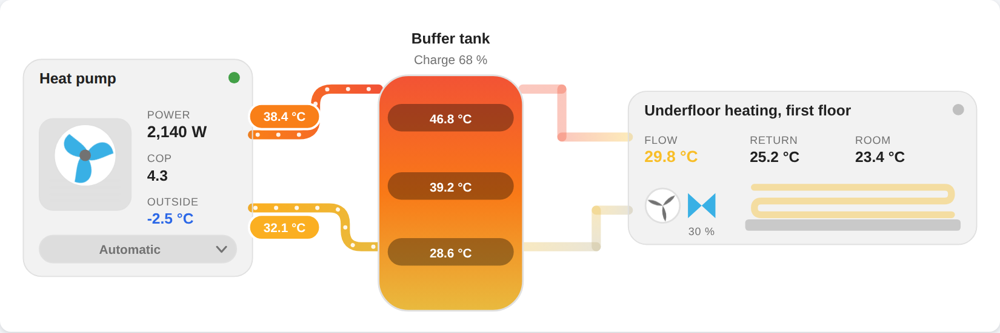

**`dual` – Heizkörper und Fußbodenheizung**

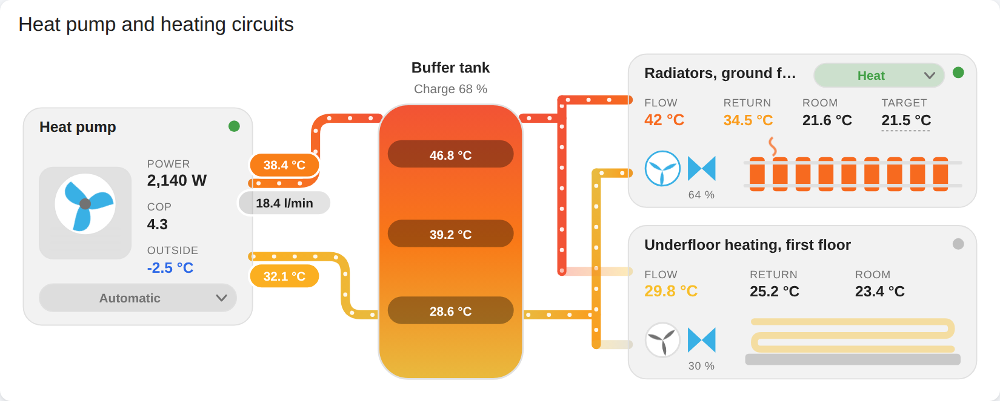

**`dhw-dual` – Warmwasser und zwei Kreise, ohne PV, ohne Solarthermie**

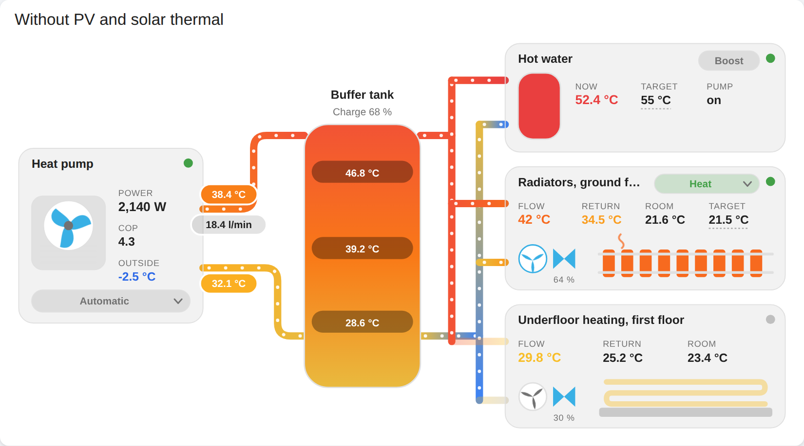

**`pv-dual` – mit Photovoltaik, ohne Solarthermie**

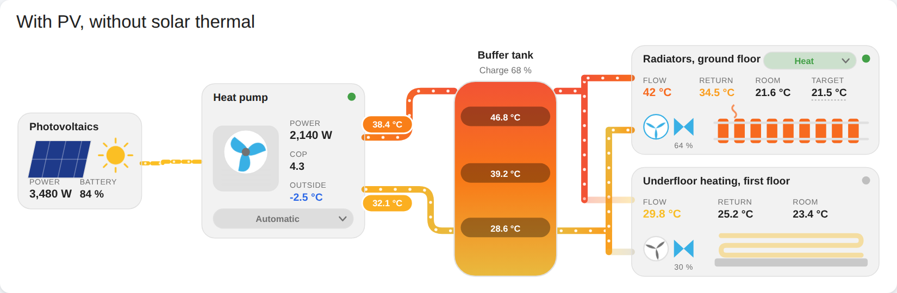

**`full` – die komplette Anlage**


**`direct-dhw` – ohne Pufferspeicher: die Wärmepumpe speist den Verteiler
direkt, hier mit vier Kreisen inklusive Gebläsekonvektor und Pool**

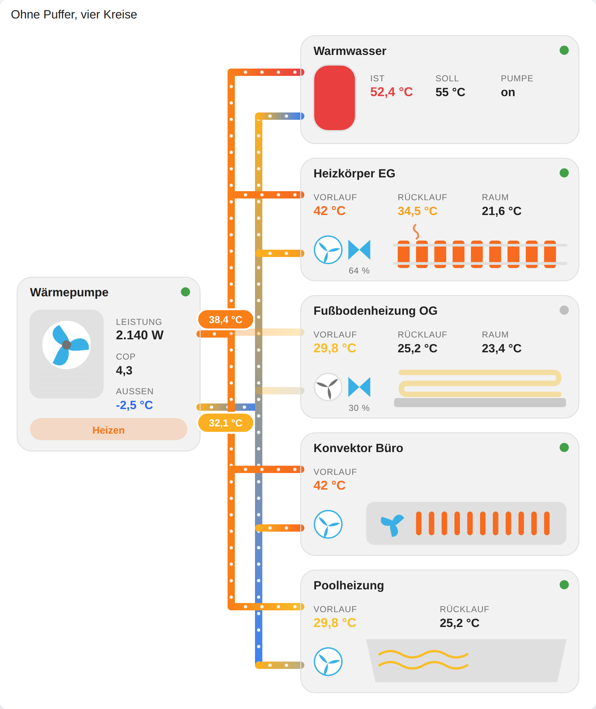

**Jeder Heizkreis zeigt seinen eigenen Zustand.** A wird versorgt, C auch; B ist
über sein Zeitprogramm geparkt und D ist aus. Panels, Pumpen und Rohre folgen
jedem Kreis einzeln – nur der Verteiler führt Wasser, solange *irgendein* Kreis
zieht.

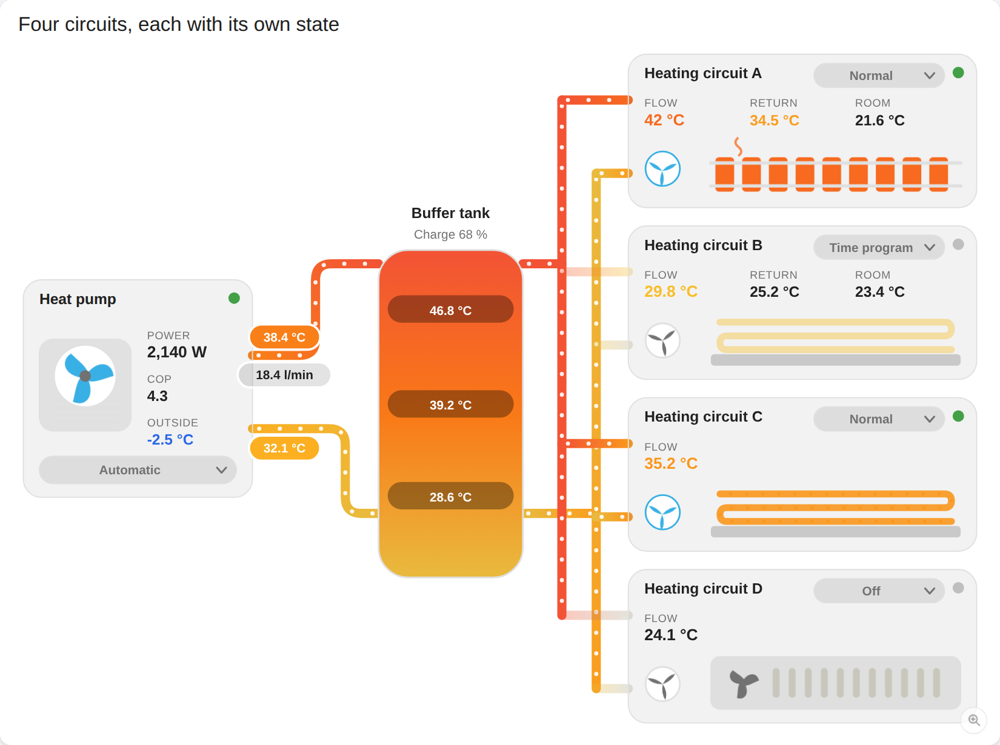

**Die elektrische Seite.** Die Wärmepumpe steht in Bereitschaft, das Dach speist
sie also nicht: Der Strom geht in die Batterie und ins Netz, und jeder Knoten
zeigt, in welche Richtung sein Strom fließt.

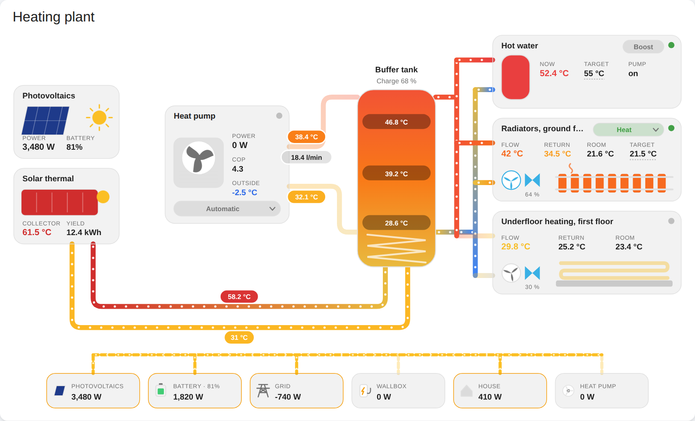

**Dunkles Theme** – die Karte übernimmt das Theme des Dashboards:

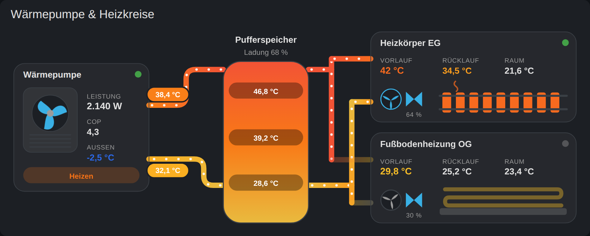

## Installation

### HACS (empfohlen)

1. HACS → Drei-Punkte-Menü → **Benutzerdefinierte Repositories**
2. Repository: `https://github.com/Xerolux/heatpump-flow-card`, Kategorie
   **Dashboard** (in älteren HACS-Versionen *Lovelace*/*Plugin*)
3. **Heat Pump Flow Card** installieren, danach den Browser neu laden.

### Manuell

1. `dist/heatpump-flow-card.js` nach `config/www/heatpump-flow-card.js` kopieren.
2. Einstellungen → Dashboards → Drei-Punkte-Menü → **Ressourcen** →
   **Ressource hinzufügen**
   * URL: `/local/heatpump-flow-card.js`
   * Typ: **JavaScript-Modul**

## Schnellstart

Karte hinzufügen, nach **Heat Pump Flow Card** suchen und im Editor die
Entitäten auswählen. Das gleiche als YAML für eine kleine Anlage:

```yaml
type: custom:heatpump-flow-card
layout: single
heatpump:
  entity: switch.waermepumpe
  flow_temp: sensor.wp_vorlauf
  return_temp: sensor.wp_ruecklauf
buffer:
  top: sensor.puffer_oben
  bottom: sensor.puffer_unten
circuits:
  - type: radiator
    pump: binary_sensor.hk1_pumpe
```

Weitere Beispiele – auch eine Anlage ohne Puffer und eine mit vier Kreisen –
liegen in [`examples/`](examples). Beispiele, Entitäts-IDs und Screenshots sind
englisch gehalten; die Karte selbst spricht Deutsch, sobald Home Assistant es
tut – die Beschriftungen in der Zeichnung kommen aus der Sprache deiner
Home-Assistant-Instanz, jeder `name:` überschreibt sie.

## Bedienen direkt in der Karte

Ein Klick tut das Naheliegende für die Entität hinter dem Element, langes
Drücken öffnet immer den Info-Dialog:

| Entität hinter dem Element | Ein Klick |
| --- | --- |
| `switch`, `light`, `fan`, `input_boolean`, `valve`, `humidifier` | schaltet um |
| `button`, `input_button`, `script`, `scene` | löst aus |
| `select`, `input_select` | öffnet die Auswahlliste |
| `number`, `input_number` | öffnet ein Plus/Minus-Stellfeld mit min/max/step |
| `climate` | öffnet HVAC-Modi und Solltemperatur |
| `water_heater` | öffnet Betriebsarten und Solltemperatur |
| `sensor`, `binary_sensor`, alles andere | öffnet more-info |

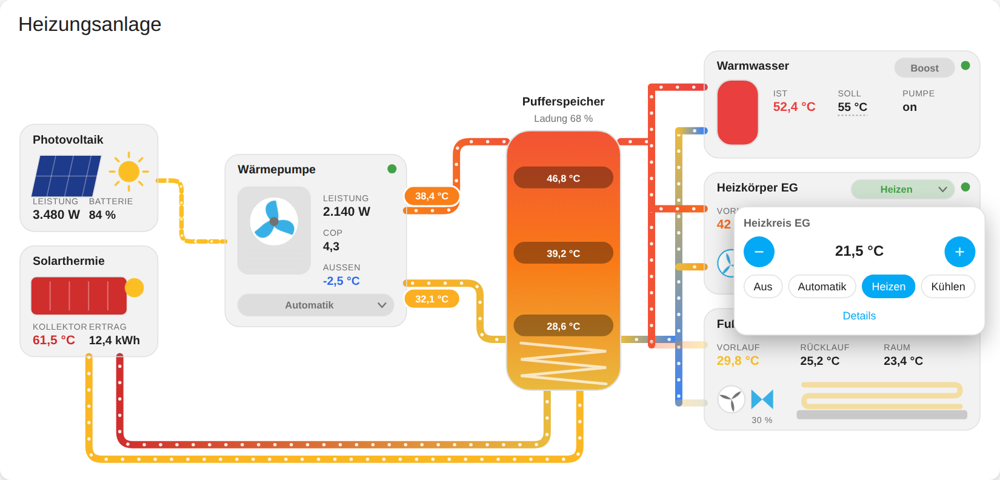

Bedienbare Werte bekommen eine gepunktete Unterstreichung, Betriebsart-Chips
einen kleinen Pfeil. Dafür gibt es zwei zusätzliche Felder:

```yaml
heatpump:
  mode: select.system_mode          # Chip an der Wärmepumpe, Klick wechselt die Betriebsart
circuits:
  - mode: climate.circuit_a         # Chip am Heizkreis
    target_temp: climate.circuit_a  # Sollwert dieses Thermostats
dhw:
  mode: water_heater.dhw            # Chip am Warmwasser
  boost: switch.onetime_dhw         # zusätzlicher Chip, ein Klick
```

Eine `climate`- oder `water_heater`-Entität als `target_temp`, `temp` oder
`room_temp` liest automatisch das passende Attribut – `target_temp:
climate.circuit_a` zeigt also den Sollwert und nicht das Wort „heat“.

Mit `controls: false` gibt es wieder nur die Info-Dialoge; einzelne Elemente
lassen sich weiterhin per `tap_action` überschreiben.

### Was sich zwischendurch zuschaltet

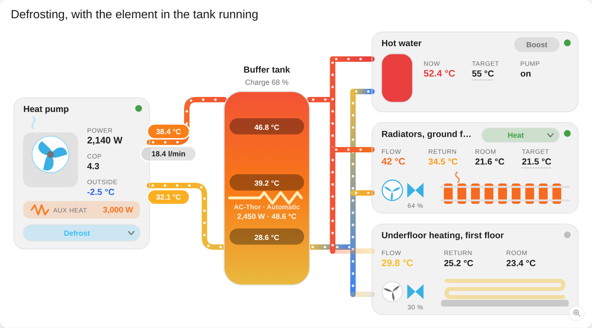

Drei Dinge, die eine Wärmepumpe tut, die man leicht übersieht und hinterher
schlecht erklären kann:

* **Der zweite Wärmeerzeuger.** `aux_heat` und `aux_heat_power` ergänzen im
  Wärmepumpen-Panel eine Zeile, die aufleuchtet, solange die bivalente Stufe
  Last übernimmt – man sieht das Zuschalten, statt es später auf der
  Stromrechnung zu finden.
* **Abtauen.** Meldet die Wärmepumpe einen Abtauvorgang, steigt Dampf vom
  Außengerät auf und der Ventilatorring wird eisblau. Erkannt aus `status`
  (oder `mode`), oder aus einem eigenen `defrost`-Binärsensor.
* **Ein Heizstab im Speicher.** `heater` und `heater_power` bei `buffer` oder
  `dhw` zeichnen einen Heizstab in den Speicher – ein my-PV AC-Thor, ein
  Booster, eine Notheizung –, der glüht, solange er Leistung zieht,
  beschriftet mit Namen, Leistung und – über `heater_temp` – seiner eigenen
  Temperatur. Mit `heater_mode` bietet ein Klick Aus / Automatik / Boost an.

```yaml
heatpump:
  mode: select.system_mode        # was sie tun soll, und worüber du es änderst
  status: sensor.operating_state  # was sie gerade tatsächlich tut
  aux_heat: binary_sensor.second_heat_generator
  aux_heat_power: sensor.heating_element_power
buffer:
  heater: switch.ac_thor
  heater_power: sensor.ac_thor_power
```

### Ein Wert aus mehreren Entitäten

Vier Wechselrichter, zwei Batterien, drei Raumfühler – jeder Wert nimmt auch
eine Liste und macht daraus eine Zahl:

```yaml
pv:
  power:                       # wird summiert
    - sensor.inverter_1_ac_power
    - sensor.inverter_2_ac_power
    - sensor.inverter_3_ac_power
    - sensor.inverter_4_ac_power
  battery:                     # wird gemittelt, weil es ein Prozentwert ist
    - sensor.battery_1_soc
    - sensor.battery_2_soc
```

Leistungen, Energien und Durchflüsse werden **summiert**, Prozentwerte und
Temperaturen **gemittelt**. Über die Langform lässt sich das überschreiben –
zusammen mit den üblichen Zusätzen:

```yaml
power:
  entities: [sensor.inverter_1_ac_power, sensor.inverter_2_ac_power]
  combine: max               # sum (Standard), avg, min, max, first
  name: Dach
  decimals: 1
```

Fehlende oder nicht verfügbare Entitäten werden übersprungen, statt die Summe
zu verfälschen; ein Klick öffnet die erste Entität der Liste.

## Größe

Die Karte füllt die Spalte, die sie bekommt, und skaliert die Zeichnung auf
diese Breite – es ist ein einziges SVG, also bleibt sie in jeder Größe scharf.
In einem Sections-Dashboard fordert sie die volle Spaltenbreite und eine Höhe,
die mit der Zahl der Verbraucher wächst; die **Grid-Optionen** von Home
Assistant an der Karte (drei Punkte → *Bearbeiten* → Layout) überschreiben
beides, wenn du es schmaler oder höher willst.

Eine Dashboard-Spalte ist trotzdem oft schmaler, als das Schema gezeichnet ist –
auf dem Handy im Hochformat wird die ganze Anlage briefmarkengroß. Dafür ist die
**Lupe unten rechts** da: Sie hebt die laufende Karte in eine bildschirmfüllende
Ebene, dieselbe Szene mit denselben Animationen, skaliert auf den Bildschirm, den
du gerade in der Hand hast. Drehst du das Handy, passt sie sich neu an; am
Monitor wird sie einfach groß. Escape, ein Klick neben die Karte oder die
Schaltfläche selbst bringen sie zurück.

Kleiner als drei Viertel der Größe, für die sie gezeichnet wurde, wird die
Zeichnung nie – darunter sind die Beschriftungen nicht mehr lesbar. Auf einem
schmalen Bildschirm bekommst du also ein lesbares Schema, das seitlich scrollt,
statt einer kleineren Briefmarke. Nach oben gibt es ebenfalls eine Grenze: Ein
4K-Schirm wird bequem darunter gefüllt, und jenseits des Dreifachen der
Designgröße würde die Zeichnung nur größer, nicht lesbarer – auf einem 4K- oder
8K-Panel hört sie deshalb dort auf und wird stattdessen zentriert.

`zoom: false` entfernt die Schaltfläche.

## Optionen

### Karte

| Option | Typ | Standard | Beschreibung |
| --- | --- | --- | --- |
| `type` | string | — | `custom:heatpump-flow-card` |
| `layout` | string | `dual` | `compact`, `single`, `dual` oder `full` |
| `title` | string | — | Überschrift der Karte |
| `animation` | boolean | `true` | Punkte durch die Rohre bewegen |
| `flow_speed` | number | `1` | Geschwindigkeit, `0.2` – `3` |
| `temperature_colors` | boolean | `true` | `false` = Vorlauf rot, Rücklauf blau |
| `controls` | boolean | `true` | `false` = jeder Klick öffnet nur more-info |
| `zoom` | boolean | `true` | Die Lupe, die die Karte bildschirmfüllend öffnet |
| `heatpump` | object | `{}` | siehe unten |
| `buffer` | object \| `false` | sichtbar | Pufferspeicher |
| `dhw` | object \| `false` | nur `full` | Warmwasser |
| `pv` | object \| `false` | nur `full` | Photovoltaik |
| `solar` | object \| `false` | nur `full` | Solarthermie |
| `circuits` | Liste | 1–2 Kreise | Heizkreise, bis zu 7 (A–G) |

### `heatpump`

| Option | Beschreibung |
| --- | --- |
| `name` | Beschriftung, Standard „Wärmepumpe“ |
| `entity` | Klick auf die Wärmepumpe schaltet diese Entität |
| `state_entity` | Entscheidet, ob die Wärmepumpe als laufend gilt |
| `mode` | Betriebsart; `Heizen`/`Kühlen`/`Warmwasser`/`Abtauen`/`Bereitschaft` werden aus dem Statustext erkannt, bei `climate`-Entitäten wird `hvac_action` automatisch verwendet |
| `power`, `cop`, `outside_temp`, `compressor` | Werte neben dem Außengerät (die ersten drei werden angezeigt, die Verdichterlast bestimmt zusätzlich die Drehzahl des Ventilators) |
| `flow_temp`, `return_temp` | Färben und beschriften die Rohre zum Speicher |
| `power_threshold` | Watt, ab denen die Wärmepumpe als laufend gilt (Standard `20`) |

Ohne `state_entity` wird der Reihe nach `power` > Schwelle, `compressor` > 0 und
zuletzt der Zustand von `entity` ausgewertet.

### `buffer`

`name`, `entity`, `top`, `middle`, `bottom`, `charge`, `heater`, `heater_power`,
`heater_temp`, `heater_mode`

Der Speicher wird mit einem Verlauf zwischen den Schichttemperaturen gefüllt.
`charge` erscheint unter dem Namen. Mit `buffer: false` speist die Wärmepumpe
die Heizkreise direkt.

### `dhw`

`name`, `entity`, `temp`, `target_temp`, `charge`, `pump`, `mode`, `boost`

### `pv` / `solar`

| Abschnitt | Optionen |
| --- | --- |
| `pv` | `name`, `entity`, `power`, `battery`, `grid`, `battery_power`, `grid_power`, `wallbox`, `house`, `threshold` (Watt, Standard `5`) |
| `solar` | `name`, `entity`, `collector_temp`, `flow_temp`, `return_temp`, `pump`, `yield` |

Der Solarkreis wird in den Boden des Pufferspeichers gezeichnet und braucht
deshalb einen Puffer.

### Die elektrische Seite

Sobald `battery_power`, `grid_power`, `wallbox` oder `house` gesetzt ist,
zeichnet die Karte unter der Anlage eine Stromschiene. Photovoltaik, Batterie,
Netz, Wallbox, Haus, Wärmepumpe und ein Heizstab im Speicher hängen daran, und
**jeder Knoten entscheidet selbst, in welche Richtung sein Strom fließt** –
steht die Wärmepumpe in Bereitschaft, wandert die Sonne also sichtbar in die
Batterie und ins Netz statt in eine Maschine, die nicht läuft.

```yaml
pv:
  power: [sensor.wechselrichter_1, sensor.wechselrichter_2]
  battery: sensor.batterie_ladestand    # Prozent, steht neben dem Namen
  battery_power: sensor.batterie_leistung # + laden, - entladen
  grid_power: sensor.netz_leistung        # + Bezug, - Einspeisung; ggf. unten umdrehen
  wallbox: sensor.wallbox_leistung        # openWB oder jede andere
  house:
    calculate: true                       # Netto-PV + Netz - Wallbox
```

Zähler sind sich nicht einig, welche Richtung positiv zählt. Zeigt ein Pfeil
falsch herum, dreht man genau diese Entität um:

```yaml
  grid_power:
    entity: sensor.netz_leistung
    invert: true
```

Die Wärmepumpe hängt über ihr eigenes `power` an der Schiene, ein Heizstab im
Speicher über `heater_power` – beides muss man nicht doppelt eintragen.
`electrics: false` auf oberster Ebene schaltet die Schiene wieder ab.

`house` kann weiterhin eine normale Home-Assistant-Entität sein. Mit
`calculate: true` berechnet die Karte den restlichen Hausverbrauch aus der
Netto-Wechselrichterleistung plus dem normalisierten Netzwert, abzüglich der
separat gezeigten Wallbox. Dabei rechnet sie auch gemischte W- und kW-Sensoren
korrekt in Watt um.

### `circuits[]`

| Option | Beschreibung |
| --- | --- |
| `name` | Beschriftung |
| `type` | `radiator`, `underfloor`, `fancoil`, `pool` oder `generic` |
| `entity` | Klick auf den Heizkreis schaltet diese Entität |
| `flow_temp`, `return_temp` | Temperaturen und Rohrfarben |
| `room_temp`, `target_temp`, `humidity` | Weitere Werte (vier werden angezeigt) |
| `mode` | Chip mit der Betriebsart (`select`, `climate` oder einfacher Sensor) |
| `pump` | Umwälzpumpe, bestimmt auch, ob der Kreis durchströmt wird |
| `valve` | Mischer, wird als Prozentwert unter dem Symbol angezeigt |

Ein Heizkreis gilt als aktiv, wenn seine `pump` an ist. Ohne Pumpe parkt ihn
eine `mode` mit *aus*, *off*, *standby*, *idle* oder *geschlossen*, sonst zählt
die Mischerstellung, dann `entity` – und erst wenn nichts davon konfiguriert
ist, der Zustand der Wärmepumpe.

### Langform für jeden Wert

Jeder Wert akzeptiert eine Entitäts-ID oder ein Objekt:

```yaml
heatpump:
  power:
    entity: sensor.wp_leistung
    name: Aufnahme
    decimals: 0
    unit: W
    attribute: null        # statt des Zustands ein Attribut lesen
    tap_action:
      action: more-info
```

`tap_action` und `hold_action` folgen der üblichen Home-Assistant-Syntax
(`more-info`, `toggle`, `navigate`, `url`, `perform-action`, `none`) und lassen
sich an jedem Element setzen – Wärmepumpe, Speicher, Heizkreis oder einzelner
Wert. Ohne Angabe werden schaltbare Entitäten umgeschaltet, alles andere öffnet
den Info-Dialog.

## Farben

Rohre und Werte folgen einer Temperaturskala: tiefblau unter 0 °C, hellblau um
15 °C, neutrales Grau bei Raumtemperatur, Bernstein ab 30 °C, Orange ab 40 °C
und Rot ab 50 °C. Werte nahe der Raumtemperatur behalten die normale Textfarbe,
damit sie lesbar bleiben. Mit `temperature_colors: false` gibt es das klassische
Schema Vorlauf rot / Rücklauf blau.

## Mehr

* **[Live-Demo](https://xerolux.github.io/heatpump-flow-card/)** – die echte
  Karte im Browser, ganz ohne Home Assistant
* **[Wiki](https://github.com/Xerolux/heatpump-flow-card/wiki)** – Installation,
  alle Optionen, Bedienung, Problemlösung, Entwicklung
* **[Beispiele](examples)** – zehn fertige Konfigurationen, darunter ein
  komplettes Dashboard

## Entwicklung

```bash
npm install
npm run check        # Syntaxprüfung
npm test             # rendert die Karte in Chromium und prüft das Verhalten
npm run screenshots  # docs/images neu erzeugen
```

`tools/preview.html` öffnet die Karte im normalen Browser mit einem
Home-Assistant-Mock – praktisch beim Feinschliff der Zeichnung.

## Kompatibilität

Die Karte ist herstellerneutral. Sie weiß nichts über konkrete Hardware – sie
liest und schreibt ganz normale Home-Assistant-Entitäten und funktioniert
deshalb mit **jeder** Wärmepumpe, Solarthermie, Photovoltaik, jedem
Pufferspeicher und jeder Heizungssteuerung, solange die Werte in Home Assistant
ankommen. Ob sie aus einer Hersteller-Integration, per Modbus, MQTT, ESPHome,
von einem Shelly oder aus ein paar DS18B20-Fühlern kommen, spielt keine Rolle:
das passende Feld auf die richtige Entität zeigen lassen, und die Zeichnung
folgt.

Für die Bedienung gilt dasselbe – alles Schreibbare funktioniert, egal ob
`switch`, `number`, `select`, `climate` oder `water_heater`.

Eine der Beispieldateien ist zufällig auf die IDM-Integration verdrahtet, weil
die genau diese Entitätstypen bereitstellt. Das ist ein Beispiel, keine
Voraussetzung.

## Changelog

Jedes Release ist in [CHANGELOG.md](CHANGELOG.md) beschrieben.

## Unterstützen

Die Karte ist kostenlos und bleibt es. Wenn sie dir das Leben mit deiner Anlage
leichter macht und du die Arbeit unterstützen möchtest, freut mich jedes davon
riesig – erwartet wird nichts:

[](https://www.buymeacoffee.com/xerolux)
[](https://ko-fi.com/xerolux)
[](https://paypal.me/xerolux)
[](https://github.com/sponsors/Xerolux)

[Tesla Referral](https://ts.la/sebastian564489) · oder einfach ein Stern für das Repository.
